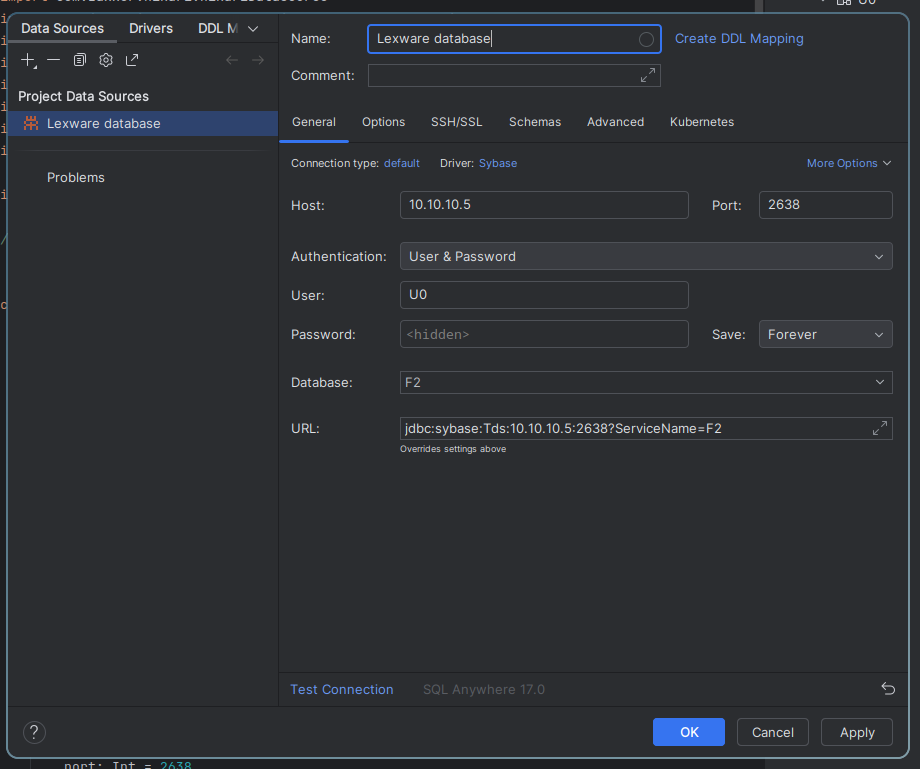

# Lexerix

[Kotlin](https://kotl.in) API using [Jetbrains Exposed](https://github.com/JetBrains/Exposed) for accessing the
[Lexware Financial Office](https://shop.lexware.de/unternehmenssoftware) database.

Tested with:
- Lexware Financial Office Pro 2024

## License

This project is licensed under the MIT License - see the [LICENSE](LICENSE) file for details.
Additionally, Lexerix connects to the Lexware database using the jConnect driver,
which is licensed under the [jConnect License Agreement](LICENSE_jconnect).

## Prerequisites

### Obtaining the initial credentials for the U0 account

The *initial* password for the privileged U0 user can be found in the `LexGlob.log` file.
Example path: `C:\ProgramData\Lexware\professional\Datenbank\F0\LexGlob.log`

Find the file and search for `Supervisor`; the 16-digit clear-text password should be right
next to it (example: `abc123def456ghi7`).

> ⚠️ The corresponding username is `U0`, **not** `Supervisor`!

### Creating new database users (recommended!)

1. Open SQL Central (see guide below)
2. (Maybe) Un-set the Supervisor password to "" (empty string) in Lexware (this resets the DB
password to the initial one)
3. Connect to the database using U0 // [initial password in LexGlob.log]
4. Create an admin user in both `LXOFFICE` and `FX` (your company database)
5. Re-set the Supervisor password to a secure value in Lexware
6. Check that STEP 3 does not work anymore (U0 password is now changed)
7. Connect to the database using the new admin user
8. Create a new un-privileged user for your application in both `LXOFFICE` and `FX` (your company database)
   1. User in `LXOFFICE` does not need any roles/permissions
   2. User in `FX`: Roles => "F1" User-extended role, Table Privileges => e.g. "FK_Artikel" SELECT, ...

It is also recommended to limit the maximum amount of DB connections per user to prevent
database server out-of-memory errors when lexerix goes crazy:


For additional information see [this guide](https://armann-systems.com/wiki/lexware-datenbankzugriff/).

### Adding the library to your project

[](https://central.sonatype.com/artifact/toys.timberix/lexerix)

#### Gradle
```kotlin
repositories {
    // ...
    mavenCentral()
}
dependencies {
    // ...
    // replace VERSION with the latest version
    implementation("toys.timberix:lexerix:VERSION")
}
```
For more implementation instructions,
see the [Maven Central Page](https://central.sonatype.com/artifact/toys.timberix/lexerix).

## Usage

### Connecting to the database
```kotlin
val lexerix = Lexerix()
// Replace values accordingly
// This will start the company database if it is not already running
lexerix.connect("F2", "localhost", "YOUR_DB_USER", "YOUR_PASSWORD")
```    

### Using the API
> ⚠️ Writing to the database is **not** recommended and may lead to data corruption. Use at your own risk.
```kotlin
// List all customers
transaction {
    println("Customers:")
    InventoryManagement.Customers.selectAll().forEach {
        println(" - '${it[anschriftVorname]} ${it[anschriftName]}' from company '${it[anschriftFirma]}'")
    }
}

// Insert customer
transaction {
    println("Inserting customer...")
    InventoryManagement.Customers.insertUnique {
        it[matchcode] = "lexerix-john-doe"
        it[anschriftFirma] = "John's Company"
        it[anschriftName] = "Doe"
        it[anschriftVorname] = "John"
    }
}
```

### Custom queries
```kotlin
// Get company type/description of first company from BH_FIRMA table
val companyType = transaction {
    exec("SELECT TOP 1 * FROM F2.F1.BH_FIRMA") {
        it.next()
        it.getString("szUnternehmensart")
    }
}
println("First accounting company description: '$companyType'")
```

See [Example.kt](src/test/kotlin/Example.kt)
and [OrderExamples.kt](src/test/kotlin/OrderExamples.kt) for more examples.


## Database

Lexware uses Sybase SQL Anywhere 17. The **company** database is roughly structured as follows:

### `FX.F1`:
(replace `X` with the company number)
- `AV`: Anlagenverwaltung // asset management
- `BH`: Buchhaltung // accounting
- `LG`: Lohn und Gehalt // payroll
- `FK`: Warenwirtschaft // inventory management

### Connecting via IntelliJ/DataGrip

